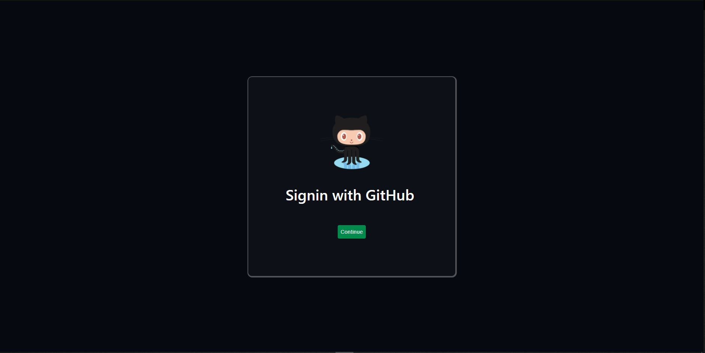

# Getting started with GH Edit

1. Clone the project onto your local machine
2. Open the project via an editor that can interact with Node
3. In the root directory, type "npm i" to get all necessary dependencies
4. Reference .env.example for a proper way to include your own GitHub access token in a .env or .env.development file
5. In the terminal, type "npm start" to start using the application
6. Sign in with GitHub and notice your repositories displayed

NOTE:  You must have a folder in the "main", not master, branch of each GitHub repository.  Inside this folder, include one single image (a.jpg, b.png etc.)  This allows each card to have a background, as opposed to having an upload image tool.

# UI

Logging in

Repositories
